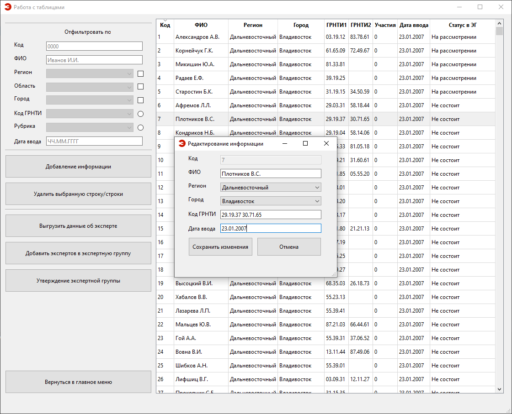

# Expertise Management System

## Overview

This project is a CRUD application developed as a part of the "Database Management Systems" course. It focuses on managing the organization of expertise for scientific and technical projects. The objective is to create a tool that facilitates the formation of expert groups for conducting evaluations of these projects.

## Key Features

### 1. Database Integrity Control

Ensures the integrity of the system's source databases, with mechanisms for control and recovery.

### 2. Expert Information Management

Allows the addition and editing of expert information in the database. It verifies newly entered data to ensure data integrity.

### 3. Prevention of Duplicate Entries

Controls the possible re-entry of expert data to avoid duplication.

### 4. Data Filtering

Enables the filtering of information in the database based on criteria such as surname, federal district, subject of the federation, city, rubric, or GRNTI (Code of State Categories Scientific and Technical Information) code.

### 5. Expert Group Formation

Facilitates the formation of expert groups by fixing selected subsets into named expert groups.

### 6. Candidate Review

Provides the ability to view records of selected candidate groups for inclusion in the expert group. Allows marking decisions on including candidates in the group.

### 7. Base Database Viewing

Allows the viewing of records in the initial database with the ability to mark experts as candidates for inclusion in the expert group.

### 8. Group Approval

Allows the approval of an expert group with no further possibility of adjusting the composition, increasing the number of participations in evaluations in the main database.

### 9. Document Generation

Supports the generation of documents, including a table listing the formed expert group and individual expert cards.
